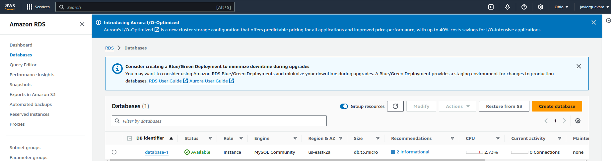
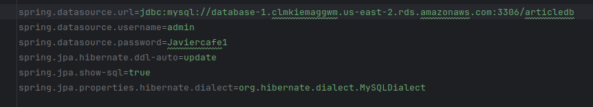
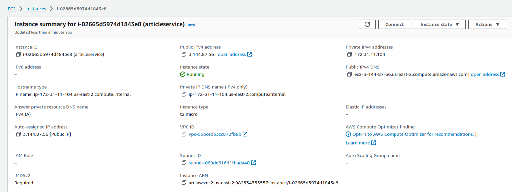
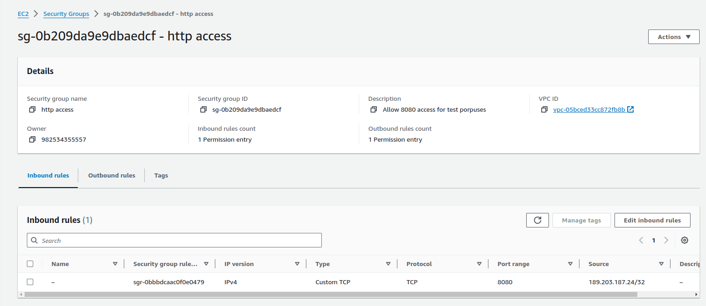
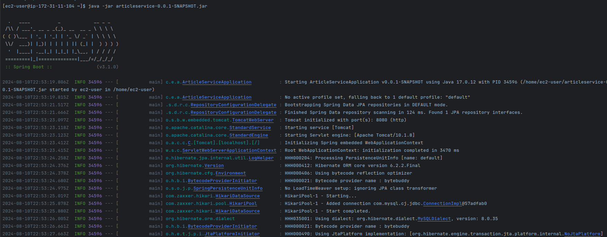
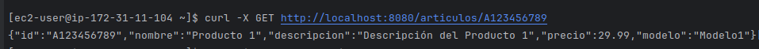

# Servicio de Gestión de Artículos

## Descripción
Este proyecto implementa un servicio web RESTful para consultar y actualizar información de artículos utilizando Spring Boot y desplegado en AWS.

## Requisitos
- Java 17
- Gradle
- Cuenta de AWS

## Configuración de AWS
### AWS RDS
1. Crear una instancia de base de datos MySQL en AWS RDS.

2. Configurar la conexión a la base de datos en el archivo `application.properties`.

### AWS EC2
1. Crear una instancia EC2 utilizando Amazon Linux.

2. Configurar el Security Group para permitir tráfico HTTP y SSH.

3. Instalar Java en la instancia EC2.
4. Transferir el archivo JAR de la aplicación a la instancia EC2.
   ```bash
   scp -i /home/victor/Downloads/articleservice.pem build/libs/articleservice-0.0.1-SNAPSHOT.jar  ec2-user@3.144.87.56:/home/ec2-user
5. Ejecutar la aplicación en la instancia EC2.

## Ejecución del Servicio
1. Conectarse a la instancia EC2 usando SSH.
2. Ejecutar la aplicación Spring Boot con el comando:
   ```bash
   java -jar /home/ec2-user/your-application.jar
3. Probar el servicio
